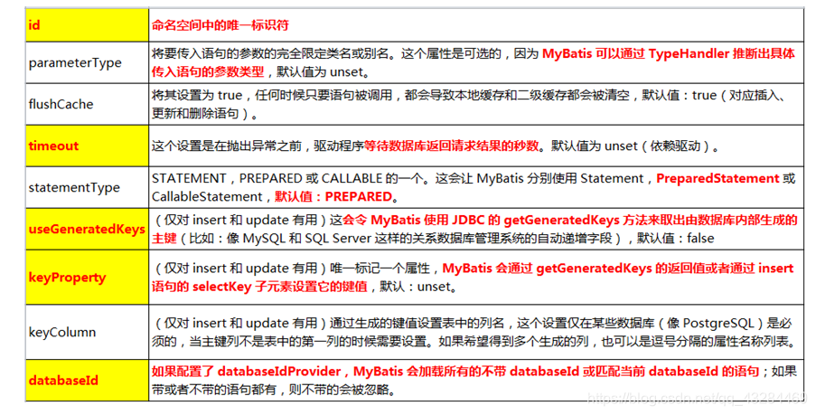
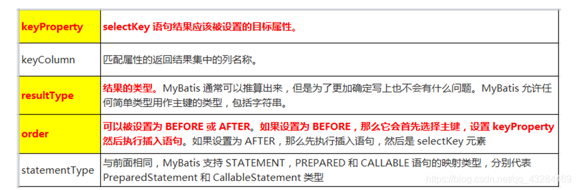

# 一、MyBatis简介

- MyBatis 是支持定制化 SQL、存储过程以及高级映射的优秀的持久层框架。
- MyBatis 避免了几乎所有的 JDBC 代码和手动设置参数以及获取结果集。

- MyBatis可以使用简单的XML或注解用于配置和原始映射，将接口和Java的POJO（Plain Old Java Objects，普通的Java对象）映射成数据库中的记录.


## 1、历史

- 原是Apache的一个开源项目iBatis, 2010年6月这个项目由Apache Software Foundation 迁移到了Google Code，随着开发团队转投Google Code旗下， iBatis3.x正式更名为MyBatis ，代码于2013年11月迁移到Github（下载地址见后）。
- iBatis一词来源于“internet”和“abatis”的组合，是一个基于Java的持久层框架。 iBatis提供的持久层框架包括SQL Maps和Data Access Objects（DAO）


## 2、为什么要使用MyBatis？

- MyBatis是一个【半自动化】的持久化层框架。
- JDBC


> –SQL夹在Java代码块里，耦合度高导致硬编码内伤
>
> –维护不易且实际开发需求中sql是有变化，频繁修改的情况多见

- Hibernate和JPA

> –长难复杂SQL，对于Hibernate而言处理也不容易
>
> –内部自动生产的SQL，不容易做特殊优化。
>
> –基于全映射的全自动框架，大量字段的POJO进行部分映射时比较困难。导致数据库性能下降。

- 对开发人员而言，核心sql还是需要自己优化

- sql和java编码分开，功能边界清晰，一个专注业务、一个专注数。


## 3、去哪里找MyBatis？

•https://github.com/mybatis/mybatis-3/


# 二、MyBatis-HelloWorld

​	HelloWorld简单版

> –1创建一张测试表
>
> –2创建对应的javaBean
>
> –3创建mybatis配置文件，
>
> - 写配置(两个,全局配置文件(指导mybatis运行的) , dao接口的实现文件(描述dao中每个方法怎么工作) )
> - 第一个配置文件; (称为mybatis的全局配置文件,指导mybatis如何正确运行,比如连接向哪个数据库)
> - 第二个配置文件: (编写每一一个方法都如何向数据库发送sq|语句,如何执行。。。。相当于接口的实现类)
>   	将mapper的namespace属性改为接口的全类名
>   	配置细节
>
> -4创建sql映射文件
>
> -5在全局配置文件注册
>
> –6测试

## 1、创建一张测试表


## 2、创建对应的javaBean与dao接口

Employee:

```java
public class Employee {
    private Integer id;
    private String empName;
    private Integer gender;
    private String email;
    //省略有参无参、get/set()、toString()
}    
```


EmployeeDao接口：

```java
public interface EmployeeDao {//按照id查询员工
	public Employee getEmpById(Integer id);
}
```
## 3、创建mybatis全局配置文件

mybatis_config.xml

```XML
<?xml version="1.0" encoding="UTF-8" ?>
<!DOCTYPE configuration
        PUBLIC "-//mybatis.org//DTD Config 3.0//EN"
        "http://mybatis.org/dtd/mybatis-3-config.dtd">
<configuration>
    <environments default="development">
        <environment id="development">
            <transactionManager type="JDBC"/>
            <!--配置连接池-->
            <dataSource type="POOLED">
                <property name="driver" value="com.mysql.jdbc.Driver"/>
                <property name="url" value="jdbc:mysql://localhost:3306/mybatis_achang"/>
                <property name="username" value="root"/>
                <property name="password" value="00000"/>
            </dataSource>
        </environment>
    </environments>
    
    <mappers>
        <mapper resource="org/mybatis/example/BlogMapper.xml"/>
    </mappers>
</configuration>
```
## 4、创建sql映射文件

xml配置文件版的 dao接口的实现描述，

public Employee getEmpById(Integer id);

mapper标签
	namespace属性：名称空间；写接口的全类名
select标签：用来定义一个查询操作
    id属性：方法名；相当于对于某个方法的实现
    resultType属性：方法运行后的返回值类型（查询操作必须指定）
    #{属性名}：代表取出传递过来的某个参数的值

EmployeeDao.xml:

```xml
<?xml version="1.0" encoding="UTF-8" ?>
<!DOCTYPE mapper
        PUBLIC "-//mybatis.org//DTD Mapper 3.0//EN"
        "http://mybatis.org/dtd/mybatis-3-mapper.dtd">
<mapper namespace="com.achang.dao.EmployeeDao">
    <select id="getEmpById" resultType="com.achang.bean.Employee">
        select * from t_employee where id = #{id}
    </select>
    <!--增删改不用写返回值类型-->
    <update id="updateEmp" >
        update t_employee set empname = #{empName},gender = #{gender},email = #{email} where id = #{id}
    </update>
    <delete id="deleteEmpById">
        delete from t_employee where id = #{id}
    </delete>
    <insert id="insertEmp">
        insert into t_employee(empname,gender,email)
                values(#{empName},#{gender},#{email})
    </insert>
</mapper>

```

我们写的dao接口的实现文件, mybatis默认是不知道的,需要在全局配置文件中注册

## 5、在全局配置文件注册

在mybatis_config.xml中配置:

```xml
<!--mappers标签：引入自己编写的每一个接口的xml实现文件
		resource属性：引入xml实现文件的位置
-->
<mappers>
	<mapper resource="EmployeeDao.xml"/>
</mappers>
```

在此注册让Mybatis知道我们的dao实现xml文件在哪里

## 6、测试

完整的查询语句测试：


```java
@Test
public void test1() throws IOException {
    //1、根据全局配置文件创建出一个sqlSessionFactory
    //SqlSessionFactory:是SqlSession工厂，负责创建SqlSession对象
    //SqlSession对象：sql会话---(代表和数据库的一次会话)
    String resource = "mybatis_config.xml";
    InputStream inputStream = Resources.getResourceAsStream(resource);
    SqlSessionFactory sqlSessionFactory = new SqlSessionFactoryBuilder().build(inputStream);

    Employee employee = null;
    SqlSession openSession = null;
    try {
        //2、获取和数据库的一次会话；与getConnection()；拿到一条连接
        sqlSessionFactory.openSession();
        //3、使用SqlSession操作数据库，获取到dao接口的实现
        EmployeeDao employeeDaoImpl = openSession.getMapper(EmployeeDao.class);
        //4、拿到dao接口impl实现类后，调用相对于的方法即可
        employee = employeeDaoImpl.getEmpById(1);
    } catch (Exception e) {
        e.printStackTrace();
    } finally {
        openSession.close();
    }
    System.out.println(employee);//Employee{id=1, empName='admin', gender=0, email='admin@qq.com'}
}

```


## 7,增删改查语句PLUS：

*注意!!!注意!!!注意!!!*

增删改需要设置事务

1. 要在方法中最后try-catch-finally关闭资源，增删改需要手动提交事务

2. openSession(true)；设置是否自动提交事务，true为自动提交，false为不自动提交（例子：修改方法）

   


```java
public class EmployeeTest {
	//工厂在类中创建一次即可
    SqlSessionFactory sqlSessionFactory;
    //每次调用自动的执行，一次会话一次连接
    @Before
    public void initSqlSessionFactory() throws IOException {
        String resource = "mybatis_config.xml";
        InputStream inputStream = Resources.getResourceAsStream(resource);
        sqlSessionFactory = new SqlSessionFactoryBuilder().build(inputStream);
    }

    //查询
    @Test
    public void test1() throws IOException {
        SqlSession sqlSession = sqlSessionFactory.openSession();
        EmployeeDao mapper = sqlSession.getMapper(EmployeeDao.class);
        Employee empById = mapper.getEmpById(3);
        System.out.println(empById);
    }

    //修改
    @Test
    public void test2() throws IOException {
        //openSession(true)设置自动提交事务
        SqlSession sqlSession = sqlSessionFactory.openSession(true);
        int updateEmp = 0;
        try {
            EmployeeDao mapper = sqlSession.getMapper(EmployeeDao.class);
            updateEmp = mapper.updateEmp(new Employee(3, "欧尼", 1, "achang@qq.com"));
        } catch (Exception e) {
            e.printStackTrace();
        } finally {
            sqlSession.close();
        }
        System.out.println(updateEmp);
    }

    //新增
    @Test
    public void test3() throws IOException {
        SqlSession sqlSession = sqlSessionFactory.openSession();
        int insertEmp = 0;
        try {
            EmployeeDao mapper = sqlSession.getMapper(EmployeeDao.class);
            insertEmp = mapper.insertEmp(new Employee(null, "我我", 0, "sisi@qq.com"));
        } catch (Exception e) {
            e.printStackTrace();
        } finally {
            sqlSession.commit();
            sqlSession.close();
        }
        System.out.println(insertEmp);

    }

    //删除
    @Test
    public void test4() throws IOException {
        SqlSession sqlSession = sqlSessionFactory.openSession();
        boolean empById = false;
        try {
            EmployeeDao mapper = sqlSession.getMapper(EmployeeDao.class);
            empById = mapper.deleteEmpById(8);
        } catch (Exception e) {
            e.printStackTrace();
        } finally {
            sqlSession.commit();
            sqlSession.close();
        }
        System.out.println(empById);

    }

}

```

## 8、细节

两个文件：

1. 全局配置文件：mybatis-config.xml；指导mybatis正确运行的一些全局设置
2. SQL映射文件：EmployeeDao.xml；相当于是对Dao接口的一个实现描述细节；

细节：

1. 获取到的是接口的代理对象；mybatis自动创建的
2. SqlSessionFactory和SqlSession；


> SqlSessionFactory：创建SqlSession对象，Factory只new一次就行
>
> SqlSession：相当于connection，是和数据库进行交互的，也是一次和数据库的一次会话，就应该创建一个新的的SqlSession，一次与数据库连接，就创建一次会话

# 三、全局配置文件

**实例：**

mybatis_config.xml

```xml
<?xml version="1.0" encoding="UTF-8" ?>
<!DOCTYPE configuration
        PUBLIC "-//mybatis.org//DTD Config 3.0//EN"
        "http://mybatis.org/dtd/mybatis-3-config.dtd">
<configuration>
    <environments default="development">
        <environment id="development">
            <transactionManager type="JDBC"/>
            <dataSource type="POOLED">
                <property name="driver" value="com.mysql.jdbc.Driver"/>
                <property name="url" value="jdbc:mysql://localhost:3306/mybatis_achang"/>
                <property name="username" value="root"/>
                <property name="password" value="00000"/>
            </dataSource>
        </environment>
    </environments>

    <mappers>
        <mapper resource="EmployeeDao.xml"/>
    </mappers>
</configuration>

```

MyBatis 的配置文件包含了会深深影响 MyBatis 行为的设置和属性信息

且配置文档的结构有规定先后顺序

```dtd
<!ELEMENT configuration (properties?, settings?, typeAliases?, typeHandlers?, objectFactory?, objectWrapperFactory?, reflectorFactory?, plugins?, environments?, databaseIdProvider?, mappers?)>
```


## 1、properties（属性）

作用：通过properties标签引入外部内容

properties标签：和Spring的context：property-placeholder；引用外部配置文件
resource属性：从类路径下引入
url属性：引用磁盘路径或网络路径

dbconfig.properties：

```properties
username=root
password=123456
url=jdbc:mysql://localhost:3306/mybatis
driver=com.mysql.jdbc.Driver
```

mybatis_config.xml

通过${ }动态取出配置文件中的内容

```xml
<?xml version="1.0" encoding="UTF-8" ?>
<!DOCTYPE configuration
        PUBLIC "-//mybatis.org//DTD Config 3.0//EN"
        "http://mybatis.org/dtd/mybatis-3-config.dtd">
<configuration>
    <properties resource="dbconfig.properties"/>
    <environments default="development">
        <environment id="development">
            <transactionManager type="JDBC"/>
            <dataSource type="POOLED">
                <!--${}取出配置文件中的值-->
                <property name="driver" value="${driver}"/>
                <property name="url" value="${url}"/>
                <property name="username" value="${username}"/>
                <property name="password" value="${password}"/>
            </dataSource>
        </environment>
    </environments>

    <mappers>
        <mapper resource="EmployeeDao.xml"/>
    </mappers>

</configuration>

```

## 2、settings（设置）

settings是 MyBatis 中极为重要的调整设置，它们会改变 MyBatis 的运行时行为。

| 设置名                   | 描述                                                         | 有效值        | 默认值 |
| ------------------------ | ------------------------------------------------------------ | ------------- | ------ |
| mapUnderscoreToCamelCase | 是否开启驼峰命名自动映射，即从经典数据库列名 A_COLUMN 映射到经典 Java 属性名 aColumn。 | true \| false | False  |

```xml
<configuration>
    <settings>
        <setting name="mapUnderscoreToCamelCase" value="true"/>
    </settings>
</configuration>
```

3、typeAliases（类型别名）
推荐还是使用全类名!!!

类型别名：为常用的类型起别名
        typeAlias属性：就是为一个javaBean起别名；别名默认就是类名（不区分大小写），配置文件中就可以用别名了
                alias属性：指定一个别名
        package属性：批量起别名
                name属性：指定一个包名，默认别名就是类名
                @alias()注解:起别名

```xml
<typeAliases>
    <typeAlias type="com.liobio.bean.Employee" alias="emp"/>//起别名
    <package name="com.liobio.bean"/>//批量起别名
</typeAliases>
```

常见的 Java 类型内建的类型别名。它们都是不区分大小写的，为了应对原始类型的命名重复，采取了特殊的命名风格。

| 别名       | 映射的类型 |
| :--------- | :--------- |
| _byte      | byte       |
| _long      | long       |
| _short     | short      |
| _int       | int        |
| _integer   | int        |
| _double    | double     |
| _float     | float      |
| _boolean   | boolean    |
| string     | String     |
| byte       | Byte       |
| long       | Long       |
| short      | Short      |
| int        | Integer    |
| integer    | Integer    |
| double     | Double     |
| float      | Float      |
| boolean    | Boolean    |
| date       | Date       |
| decimal    | BigDecimal |
| bigdecimal | BigDecimal |
| object     | Object     |
| map        | Map        |
| hashmap    | HashMap    |
| list       | List       |
| arraylist  | ArrayList  |
| collection | Collection |
| iterator   | Iterator   |

## 5、plugins（插件）

插件是MyBatis提供的一个非常强大的机制，我们可以通过插件来修改MyBatis的一些核心行为。插件通过动态代理机制，可以介入四大对象的任何一个方法的执行。
•Executor (update, query, flushStatements, commit, rollback, getTransaction, close, isClosed)

•ParameterHandler (getParameterObject, setParameters)

•ResultSetHandler (handleResultSets, handleOutputParameters)

•StatementHandler (prepare, parameterize, batch, update, query)


## 6、environments（环境）

default属性：默认使用哪个环境；填写某个environment标签的id
environment标签：配置一个具体的环境；每一个环境都需要一个事务管理器和数据源
	id属性：当前环境的唯一标识
	transactionManager标签：事务管理器后来数据源、事务控制管理都Spring来做

```xml
<environments default="development">
    <environment id="development">
        <transactionManager type="JDBC"/>
        <dataSource type="POOLED">
            <!--${}取出配置文件中的值-->
            <property name="driver" value="${driver}"/>
            <property name="url" value="${url}"/>
            <property name="username" value="${username}"/>
            <property name="password" value="${password}"/>
        </dataSource>
    </environment>
</environments>

```

## 7、databaseIdProvider（数据库厂商标识）

作用：mybatis用来考虑数据库移植性的-

name属性：数据库厂商标识  
value属性：给数据库厂商标识起别名 MYSQL、Oracle、SQL Server；
	

mybatis_config.xml

```xml
<databaseIdProvider type="DB_VENDOR">
    <property name="MYSQL" value="mysql"/>
    <property name="SQL Server" value="sqlserver"/>
    <property name="Oracle" value="oracle"/>
</databaseIdProvider>

```

EmployeeDao.xml

databaseId属性：选择数据库厂商别名

```xml
<!--能精确匹配就精确匹配，不能就模糊匹配-->
<select id="getEmpById" resultType="com.liobio.bean.bean.Employee">
    select * from t_employee where id = #{id}
</select>
<select id="getEmpById" resultType="com.liobio.bean.Employee" databaseId="mysql">
    select * from t_employee where id = #{id}
</select>
<select id="getEmpById" resultType="com.liobio.bean.Employee" databaseId="oracle">
    select * from t_employee where id = #{id}
</select>
```

## 8.mappers（映射器）

既然 MyBatis 的行为已经由上述元素配置完了，我们现在就要来定义 SQL 映射语句了。 但首先，我们需要告诉 MyBatis 到哪里去找到这些语句。 在自动查找资源方面，Java 并没有提供一个很好的解决方案，所以最好的办法是直接告诉 MyBatis 到哪里去找映射文件。 你可以使用相对于类路径的资源引用，或完全限定资源定位符（包括 `file:///` 形式的 URL），或类名和包名等。

class属性：引用接口全类名,可以将xml和dao接口放在同一个文件目录下，并文件名和接口名相同
             resource属性：在类路径下找sql映射文件
             url属性：从磁盘和网络路径引用sql映射文件
    						配合使用：重要的dao写配置；简单的用头注解搞定
package标签：批量注册；要求xml和dao类接口在同一个文件夹下且名字相同（可以使用设置资源文件）

name属性：dao所在的包名

例如：

```xml
<!-- 使用相对于类路径的资源引用 -->
<mappers>
  <mapper resource="org/mybatis/builder/AuthorMapper.xml"/>
  <mapper resource="org/mybatis/builder/BlogMapper.xml"/>
  <mapper resource="org/mybatis/builder/PostMapper.xml"/>
</mappers>
<!-- 使用完全限定资源定位符（URL） -->
<mappers>
  <mapper url="file:///var/mappers/AuthorMapper.xml"/>
  <mapper url="file:///var/mappers/BlogMapper.xml"/>
  <mapper url="file:///var/mappers/PostMapper.xml"/>
</mappers>
<!-- 使用映射器接口实现类的完全限定类名 -->
<mappers>
  <mapper class="org.mybatis.builder.AuthorMapper"/>
  <mapper class="org.mybatis.builder.BlogMapper"/>
  <mapper class="org.mybatis.builder.PostMapper"/>
</mappers>
<!-- 将包内的映射器接口实现全部注册为映射器 -->
<mappers>
  <package name="org.mybatis.builder"/>
</mappers>
```

# 二、SQL映射文件

SQL 映射文件只有很少的几个顶级元素（按照应被定义的顺序列出）：

- `cache` – 该命名空间的缓存配置。
- `cache-ref` – 引用其它命名空间的缓存配置。
- `resultMap` – 描述如何从数据库结果集中加载对象，是最复杂也是最强大的元素。
- `parameterMap` – 老式风格的参数映射。此元素已被废弃，并可能在将来被移除！请使用行内参数映射。文档中不会介绍此元素。
- `sql` – 可被其它语句引用的可重用语句块。
- `insert` – 映射插入语句。
- `update` – 映射更新语句。
- `delete` – 映射删除语句。
- `select` – 映射查询语句。

## 1、增删改标签

> —insert – 映射插入语句
> —update – 映射更新语句
> —delete – 映射删除语句

**id要对应实现的方法名**

```xml
<select id="getEmpById" resultType="com.liobio.bean.Employee" >
    select * from t_employee where id = #{id}
</select>
```



**数据库支持主键**：

dao.xml

```xml
</select>
<!--让MyBatis自动的将自增的id赋值给传入的employee对象的id属性
        useGeneratedKeys属性：开启自动赋值id功能
        keyProperty属性：将刚才自增的id封装给那个属性
-->
<insert id="insertEmp" useGeneratedKeys="true" keyProperty="id">
    insert into t_employee(empname,gender,email)values(#{empName},#{gender},#{email})
</insert>

```

**数据库不支持主键：selectKey**



```xml
<!--查询主键
order="BEFORE":
在核心Sq1语句之前先运行一个查询sq1查到id; 将查到的i d赋值给javaBe
-->
<selectKey order= "BEFORE" resultType="integerl" keyPrselect ="id">
         select max(id)+1 from t_ employee
</selectKey>
INSERT INTO t_ employee( id , empname , gender, email)
VALUES(#{id},#{empName},#gender,,#{email})


```

通过order属性设置运行顺序，keyProperty属性来设置查询后结果赋值给javabean的哪个对象

然后通过useGeneratedKeys属性设置打开获取主键，keyProperty属性设置javabean的id属性接收结果值

```xml
<insert id="insertEmployee" useGeneratedKeys="true" keyProperty="id">
    INSERT INTO t_ employee( empname, gender , email)
    VALUES(#{empName} , #{gender}, #{emai1})
</insert>                                                                     

```

## 2、参数（Parameters）传递

> 1、单个参数
> 	基本类型：
> 		取值：#{随便写}
> 2、多个参数：
> 		取值：#{参数名}是无效的的
> 			0,1（参数索引）或者param1，param2（第几个参数paramN）
> 	原因：
> 		只要传入多个参数，mybatis会自动的将这些参数封装到一个map中；封装时使用的key就是参数的索引和参数的第几个标识
> 		@param：为参数指定封装map时的key；命名参数
> 		我们可以告诉mybatis，封装参数map的时候别乱来
> 3、传入map
> 		封装多个参数为map，直接传递
> 4、传入bean
> 		取值：#{bean属性名}

## 3、参数处理

无论传入什么参数都要能正确的取出值;

### key/属性名

​		#{key }取值的时候可以设置一些规则:
​		id=#{id, jdbcType=INT};
​		javaType、jdbcType、mode、numericScale、resultMap、typeHandler、jdbc
​		只有jdbcType才可能是需要被指定的;
​		默认不指定jdbcType; mysql没问题; oracle没问题;
​		万一传入的数据是null;
​		mysql插入null没问题; [oracle不知道nu11到底是什么类型; ]

参数也可以指定一个特殊的数据类型:
*#{property,javaType= int , jdbcType=NUMERIC}*
*#{height , javaType=double, jdbcType=NUMERIC, numericScale=2}*
**javaType**通常可以从参数对象中来去确定

**如果null被当作值来传递，对于所有可能为空的列,jdbcType 需要被设置**

-对于数值类型，还可以设置小数点后保留的位数:

**mode属性**允许指定IN, OUT或INOUT参数。如果参数为OUT或INOUT,参数对象属性的真实值将会被改变,就像在获取输出参数时所期望的那样。